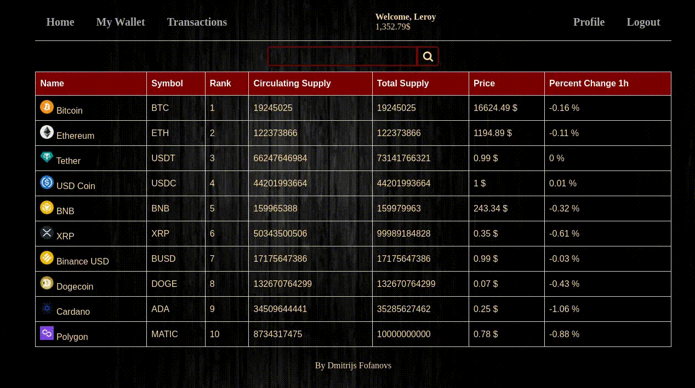
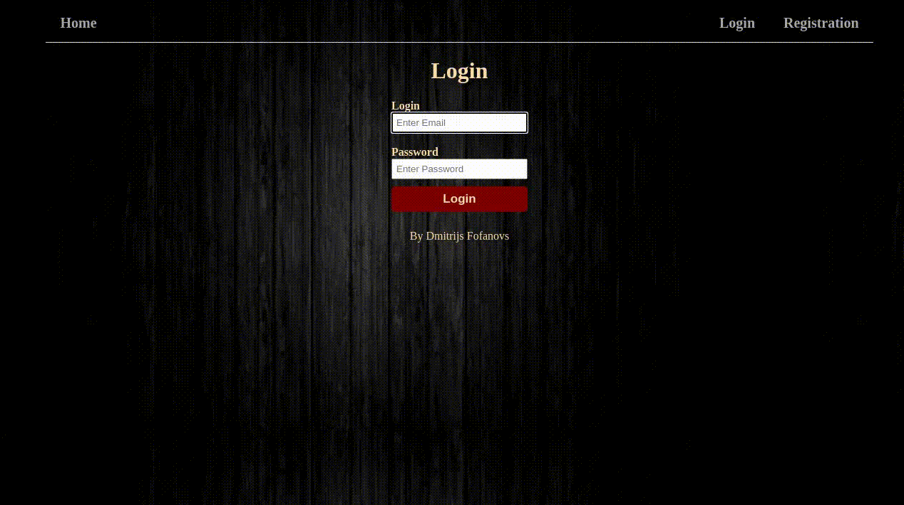
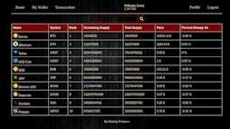
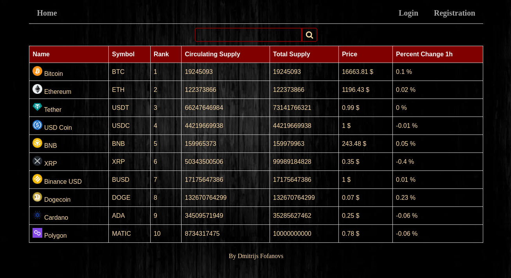

# CryptoMarker

<h2>Description: </h2>
Cryptocurrency sale using CoinMarketCap api and mysql database.
 
Features:  
<ul>
    <li>Personal wallet </li>
    <li>Transaction history</li>
    <li>Buy, Sell, Short cryptocurrencies</li>
    <li>Search cryptocurrency by symbol</li>
</ul>

<h2>Requirements: </h2>
<ol>
    <li>PHP version 7.4</li>
    <li>Mysql version 8.0.19</li>
    <li>Composer version 2.4.4</li>
</ol>
<h2>Installation guide</h2>
<ol>
    <li>Git clone the repository: git clone https://github.com/Dmitrijs1710/Crypto_market</li>
    <li>Run: composer install</li>
    <li>Create an .env file from .env-example</li>
    <li>Initialize your mysql with database.sql file and add your connection settings to .env</li>
    <li>Acquire an api key from CoinMarketCap and add your api key to .env file you created</li>
    <li>Your can run it from the console: php -S localhost:<'your desire port'></li>
</ol>

